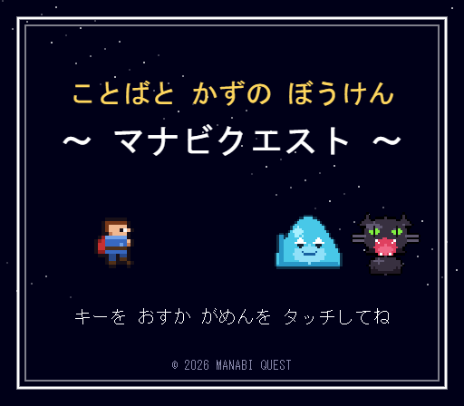
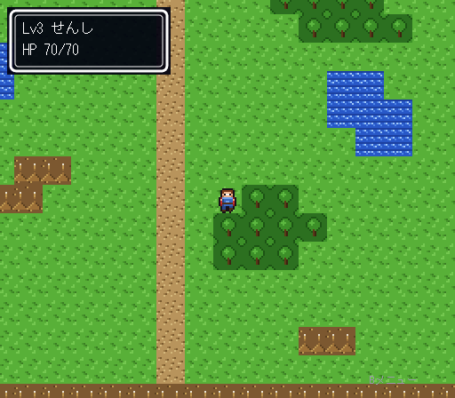
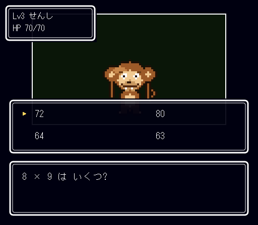

<div align="center">

# ことばと かずの ぼうけん 〜マナビクエスト〜

**絵も、音も、問題も、プログラムも — すべてを ひとつの AI が生成した 8bit 学習RPG**

[](https://github.com/TadFuji/manabi-quest/actions/workflows/deploy.yml)
[](LICENSE)
[](tsconfig.json)
[](#アセットゼロの仕組み)

**[▶ いますぐあそぶ](https://tadfuji.github.io/manabi-quest/)** — インストール不要・PC / スマホ対応



</div>

---

## 概要

小学3年生の算数・国語を、ドラクエ1風 8bit RPG の世界で学べるブラウザゲームです。
フィールドを歩くとモンスターが現れ、戦闘 = 4択問題。正解すれば敵を倒し、
間違えてもヒントをもらって再挑戦できます。魔王ナゾラーを倒せばエンディングです。

| フィールド | 戦闘(九九を盗むサル「カケザルー」) |
|:---:|:---:|
|  |  |

> 📷 上の2枚と冒頭の画像は、README 用に実行画面を記録したものです。
> ゲーム本体はこれらを含め、画像ファイルを一切読み込みません(次節)。

## アセットゼロの仕組み

このプロジェクトの核は、**画像ファイル・音声ファイルが 1 枚も存在しない**ことです。
すべての「素材」は TypeScript のデータとして表現され、実行時に生成されます。

**ドット絵** — パレット + 16進インデックス文字列。1文字が1ピクセルに対応し、
`src/engine/gfx.ts` が Canvas に展開します。

```ts
// src/data/sprites.ts(実物の抜粋)
const HERO_RIGHT_0: SpriteData = {
  w: 16, h: 16,
  palette: ['#181018', '#f0b890', '#c07850', '#783818', '#3868c0', /* … */],
  rows: [
    '................',
    '.....000000.....',
    '....03333330....',
    // … '.'は透明、16進1桁はパレット番号
  ],
};
```

**音楽・効果音** — 楽譜データ(音名と16分音符単位の長さ)を `src/engine/audio.ts` が
Web Audio API の矩形波・三角波・ノコギリ波・ノイズでリアルタイム合成します。
タイトル曲からエンディング曲まで7曲+効果音4種、すべてこのゲームのための完全オリジナル曲です。

```ts
// src/data/music.ts のデータ契約
//   NoteEvent = [noteName | null, steps]  (1 step = 16分音符, null = 休符)
{ bpm: 132, loop: true, tracks: [
  { wave: 'square',   notes: [['E5', 2], ['G5', 2], [null, 4], /* … */] },
  { wave: 'triangle', notes: [['C3', 4], ['G2', 4], /* … */] },
] }
```

**問題205問** — 分野タグ・難易度(1〜3)付きの構造化データ(`src/data/questions.ts`)。

実行時の依存ライブラリもゼロです(devDependencies は TypeScript と Vite のみ)。

## ゲームの特徴

- **完全なゲームループ** — タイトル → フィールド探索 → 戦闘 → レベルアップ(称号が変化)→ 魔王戦 → 二段構えのエンディング
- **適応出題** — 同一分野で誤答が2回たまると「苦手」と判定し、次の5問以内に必ず再出題。
  さらに直近5問の正答率で難易度(1〜3)を自動調整し、いちばん伸びる正答率70〜85%の帯を維持します
- **間違いを責めない設計** — 誤答1回目はヒントを出して再挑戦。敗北しても正解と
  「まちがいは つよくなる いっぽ。」を必ず表示し、責める言葉は使いません
- **ぼうけんのしょ** — localStorage によるセーブ。ゲームオーバーでもレベル・もんすたーずかん・苦手記録は失われません
- **モンスター8体** — 出題分野が名前から連想できるデザイン(たし算の「スライミー」、九九を盗む「カケザルー」、漢字を食う「ヨミガナーゴ」…)
- **スマホ対応** — タッチ操作(画面上の方向ボタン・タップ選択)

## 技術スタック

| 領域 | 採用技術 |
|---|---|
| 言語 | TypeScript(strict / 実行時依存ゼロ) |
| ビルド | Vite |
| 描画 | HTML5 Canvas(内部解像度 512×448) |
| 音 | Web Audio API(矩形波・三角波・ノコギリ波・ノイズ) |
| 配信 | GitHub Pages + GitHub Actions(自動デプロイ) |

## フォルダ構成

```
src/
├── engine/    描画・音・入力の基盤(ゲーム内容に依存しない)
│   ├── gfx.ts       Canvas 描画とスプライト展開
│   ├── audio.ts     Web Audio によるチップチューン合成
│   └── input.ts     キーボード・タッチ・クリックを束ねる仮想ゲームパッド
├── data/      全アセット(コードとして表現)
│   ├── sprites.ts   ドット絵(主人公・モンスター8体・地形タイル)
│   ├── music.ts     楽曲7曲+効果音4種の楽譜
│   ├── questions.ts 問題205問(分野タグ・難易度付き)
│   ├── map.ts       フィールドマップ
│   └── types.ts     データ契約の型定義
├── game/      状態管理・適応出題ロジック・モンスター定義
├── scenes/    タイトル / 物語 / フィールド / 戦闘 / ゲームオーバー / エンディング
└── main.ts    エントリポイント
scripts/       データ機械検証・1ファイル化ツール
.github/       CI/CD(検証 → ビルド → 自動公開)
```

## 品質管理

main に push するたびに GitHub Actions が次を自動実行します。

1. **型チェック** — `tsc --noEmit`(strict)
2. **データ機械検証** — `npm run validate`(`scripts/validate-data.mjs`)
   - 算数問題の式をすべて再計算し、正解の選択肢と照合(105問)
   - 全205問の ID 重複・選択肢数(4択)・難易度範囲・分野別問題数を検査
   - 全スプライトの寸法・行長・パレット参照の整合性を検査
   - 全楽曲のトラック長一致・音名文法・波形種別を検査
3. **本番ビルド** — 成功した場合のみ GitHub Pages へ公開

## 開発

```bash
npm install        # 依存をインストール(初回のみ)
npm run dev        # 開発サーバー(http://localhost:5173)
npm run build      # 型チェック + 本番ビルド → dist/
npm run validate   # ゲームデータの機械検証
npm run single     # 外部参照ゼロの1ファイル版 → dist/manabi-quest.html
```

`npm run single` で生成される `manabi-quest.html` は、ネット接続なしで
ダブルクリックするだけで遊べる単一ファイル版です。

## ライセンス

[MIT License](LICENSE) © 2026 Tadahiro Fujikawa

このゲームの絵・音・問題・プログラムは、すべて Anthropic の AI「Claude」が
コードとして生成したものです。
